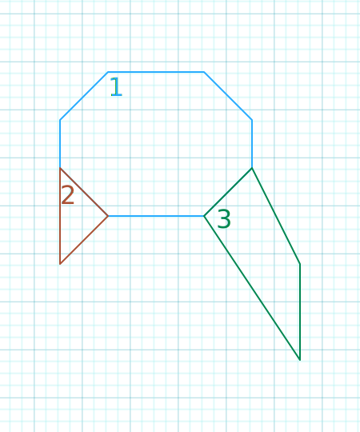

# Editor/File system
Map's created as segments.
* ### Sector
  * Sector Number
  * Wall starting point
  * How many wall's have
  * Floor height
  * Floor Texture
  * Ceiling height
  * Ceiling Texture
  ```txt
  [Sector]
  1 0 8 0.0 1 5.0 5
  2 8 3 1.0 1 4.0 5
  3 11 4 -0.2 2 6.0 6
  ```
* ### Wall
  * Starting point x
  * Starting point y
  * Ending point x
  * Ending point y
  * portal, _if portal value is 0 it means wall have collision and u cannot pass through_
  * transparency, 0 to 255
  * texture number
  ```txt
  [Wall]
  # SECTOR 1: 0..7
  4 1 2 1 0 1 10
  5 2 4 1 0 1 10
  5 3 5 2 0 1 10
  4 4 5 3 3 0 10
  2 4 4 4 0 1 10
  1 3 2 4 2 0 10
  1 2 1 3 0 1 10
  2 1 1 2 0 1 10
  
  # SECTOR 2: 8..10
  2 4 1 3 1 0 10
  1 5 2 4 0 1 10
  1 3 1 5 0 1 10
  
  # SECTOR 3: 11..14
  5 3 4 4 1 0 15
  6 5 5 3 0 1 15
  6 7 6 5 0 1 15
  4 4 6 7 0 1 15
  ```
\
| a sample map created with the examples above
# Code Structure
| gonna be filled