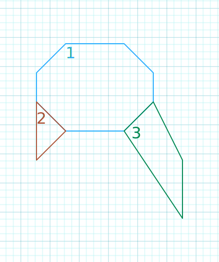

# Editor/File system
Map's created as segments.
* ### Sector
  * Sector Number
  * Wall starting point
  * How many wall's have
  * Floor height
  * Floor Texture
  * Ceiling height
  * Ceiling Texture
  ```txt
  [Sector]
  1 0 8 0.0 1 5.0 5
  2 8 3 1.0 1 4.0 5
  3 11 4 -0.2 2 6.0 6
  ```
* ### Wall
  * Starting point x
  * Starting point y
  * Ending point x
  * Ending point y
  * portal, _if portal value is 0 it means wall have collision and u cannot pass through_
  * transparency, 0 to 255
  * texture number
  ```txt
  [Wall]
  # SECTOR 1: 0..7
  4 1 2 1 0 1 10
  5 2 4 1 0 1 10
  5 3 5 2 0 1 10
  4 4 5 3 3 0 10
  2 4 4 4 0 1 10
  1 3 2 4 2 0 10
  1 2 1 3 0 1 10
  2 1 1 2 0 1 10
  
  # SECTOR 2: 8..10
  2 4 1 3 1 0 10
  1 5 2 4 0 1 10
  1 3 1 5 0 1 10
  
  # SECTOR 3: 11..14
  5 3 4 4 1 0 15
  6 5 5 3 0 1 15
  6 7 6 5 0 1 15
  4 4 6 7 0 1 15
  ```
\
| a sample map created with the examples above
# Code Structure
Map stored with arrays for easy access. We have Sector, Wall, Surface and 2dVector.

Sectors is in the Map variable on global gameEnv, and storeas as an array. Eveything is in the sector stored this struct. Walls, SectorId(`sectorNo`) etc...
```c
typedef	struct s_sector {
	int			sectorNo;
	t_wall		*walls;
	int			wallCount;
	t_surface	Floor;
	t_surface	Ceiling;
	int			placeholder;	//! need item system
}	t_sector;

typedef struct s_map{
	t_sector	*sector;
}	t_map;

// For Example: Access the sectorNo on sector 3
t_map.Sector[2].sectorNo;
```

Walls is in the Sector struct and stored as array too for same reason. Wall has 2 vector for start and end point locations, Surface for the texture and portal for the tell program what is behind this wall.
```c
typedef struct s_wall {
	t_2dVector	wallStart;
	t_2dVector	wallEnd;
	t_surface	texture;
	int			portal;
}	t_wall;

// For Example: Access the wallStart second wall's x location on sector 2
t_map.Sector[1].wallStart.x;
```

Surface is store plane's transparency, texture number and height for sector's.
```c
typedef	struct s_surface {
	unsigned char	transparency;	//* Value used for 0-255
	int				placeholder;	//! need texture system for here
	float			height;
}	t_surface;
```

Click link to learn about [2dVector](./commonStructures.md#2dVector).